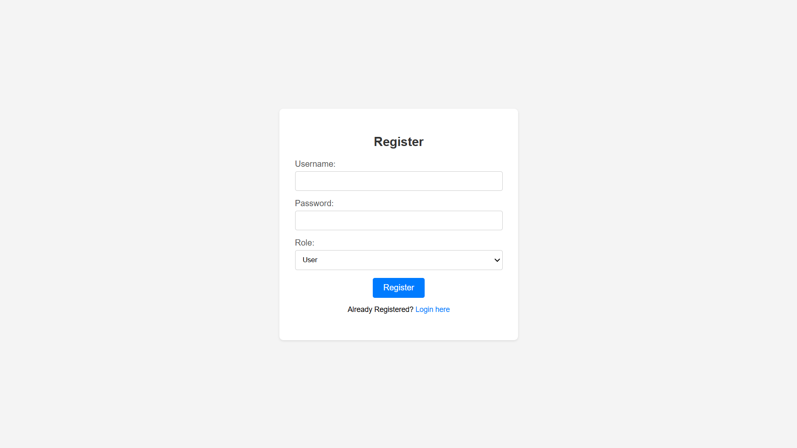
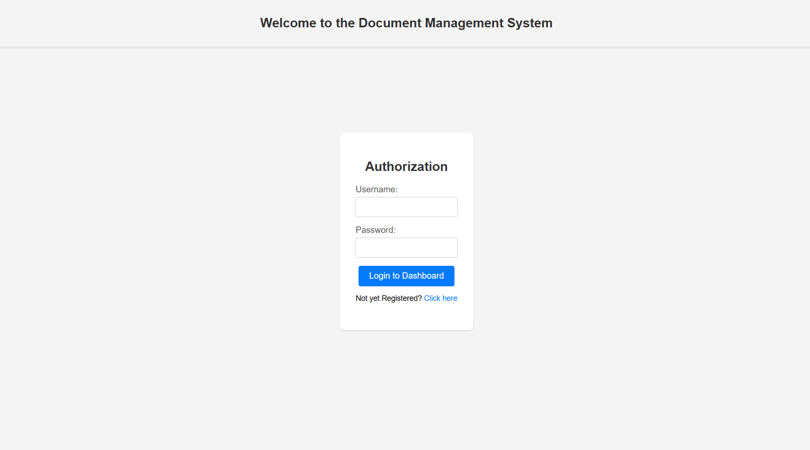
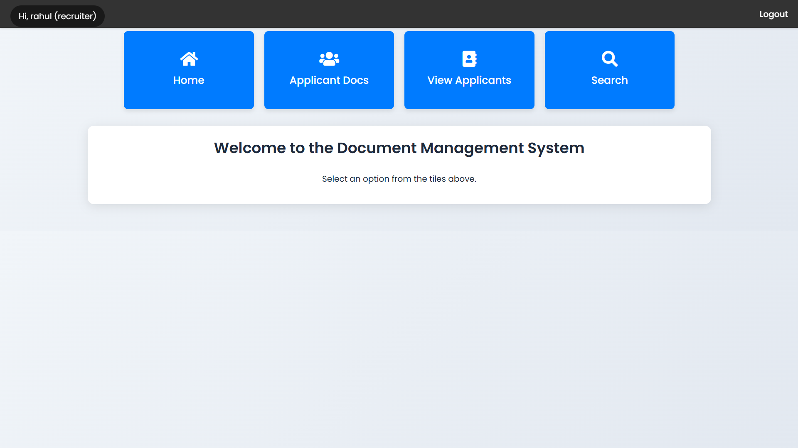
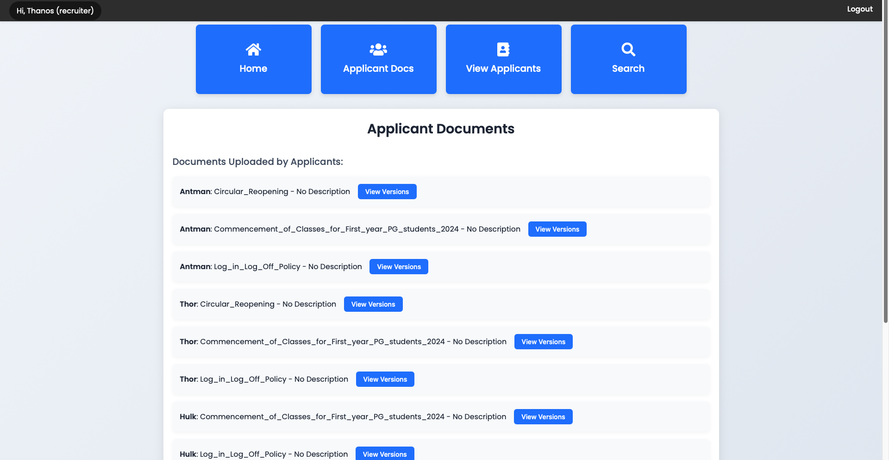
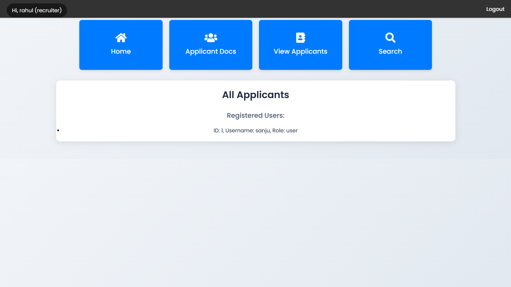
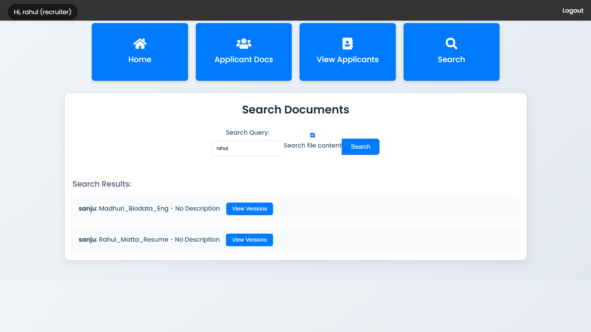
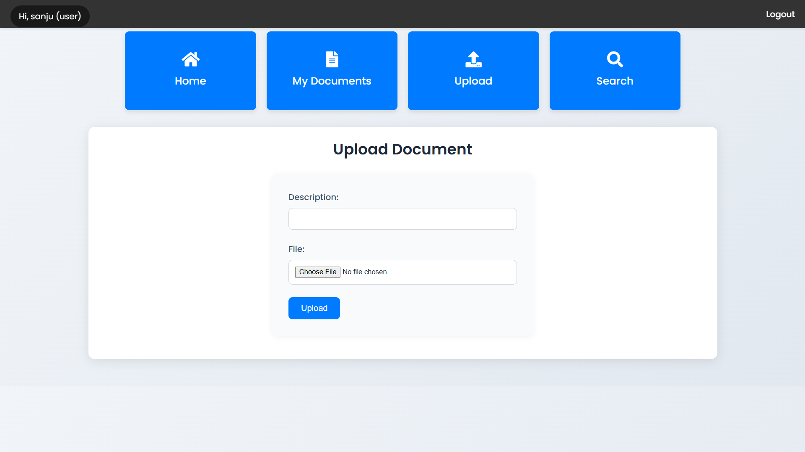
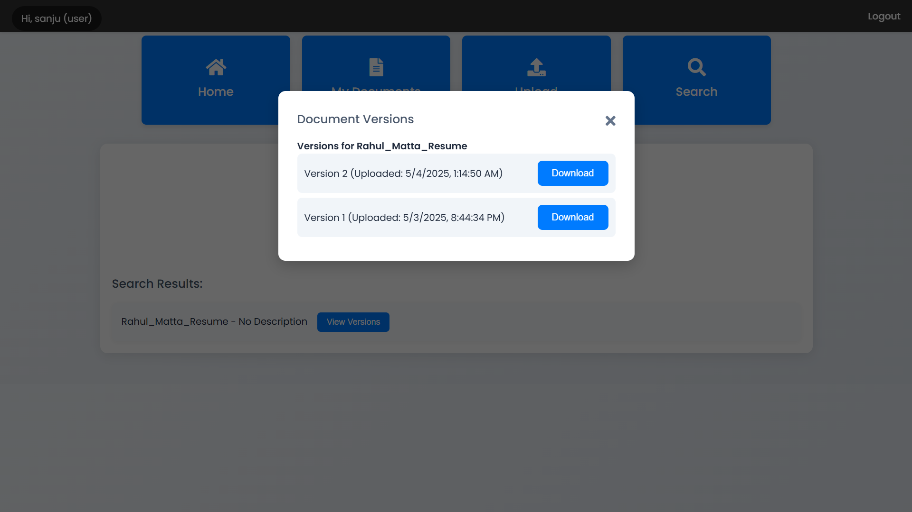

# 📁 DocuVault Project

This document outlines the prerequisites, setup instructions, and structure for the **DocuVault** project — a simple document management system with user and recruiter roles.

---

## 🧩 Project Overview

DocuVault is a web application that allows:

- **Users (Applicants)** to upload and manage versions of their documents (like resumes).
- **Recruiters** to view applicant profiles and search/download applicant documents.

---

## ⚙️ How it Works and Features

The DocuVault project follows a **client-server architecture**:

### 🖥️ Frontend

- Built with **HTML**, **Tailwind CSS**, and **JavaScript**
- Handles:
  - User login/signup
  - Navigation based on user role
  - Lists of documents/users
  - Upload forms
  - API interaction

### 🧠 Backend

- Developed using **FastAPI** (Python)
- Provides RESTful API endpoints for:
  - User authentication
  - Document upload & retrieval
  - Version management
  - Search functionality
- Connects with a **MySQL** database

### 🗄️ Database

- Stores:
  - User info (username, password hash, role)
  - Document metadata (title, description, owner)
  - Version info (file path, upload timestamp)

### 📂 File Storage

- Uploaded PDFs are securely saved to the server’s file system in a designated upload directory

---

## 🔑 Key Features

- **User Authentication**: Secure signup/login using **JWT** (JSON Web Tokens)
- **Role-Based Access Control**: Separate functionality for `user` and `recruiter` roles
- **Document Upload**: Users can upload new documents or new versions (PDF format only)
- **Document Management (User)**: View and manage uploaded documents/versions
- **Applicant Viewing (Recruiter)**: Browse documents uploaded by users
- **User Listing (Recruiter)**: View a list of all registered users
- **Document Versioning**: Supports multiple versions per document

---

---

---

---

---

---

---

---

---

---

